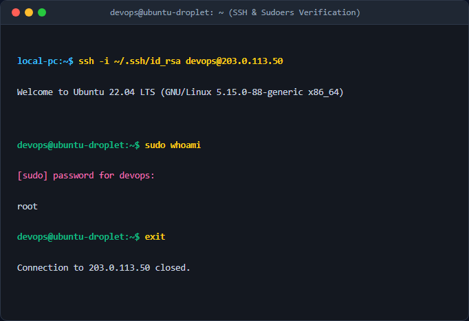

# Khởi tạo User thường và thiết lập đặc quyền quản trị Sudoers

## 1. Mục tiêu & Bối cảnh kỹ thuật
- Tuân thủ nguyên tắc đặc quyền tối thiểu (Least Privilege) trong vận hành hệ thống Linux.
- Tạo tài khoản người dùng thường mang tên `devops` để thực hiện các thao tác quản trị hàng ngày thay vì sử dụng trực tiếp tài khoản `root` tối cao nhằm giảm thiểu rủi ro bảo mật.
- Cấp quyền `sudo`, cấu hình và phân quyền chính xác SSH Key để tài khoản `devops` có thể đăng nhập an toàn từ xa.

## 2. Các bước thực hiện chi tiết
- **Bước 1: Tạo tài khoản người dùng `devops`**
  - Lệnh: `sudo useradd -m -s /bin/bash devops`
  - Giải thích: Cờ `-m` tự động tạo thư mục home `/home/devops`, cờ `-s /bin/bash` chỉ định trình thông dịch shell mặc định là Bash.
- **Bước 2: Thêm user vào nhóm sudo**
  - Lệnh: `sudo usermod -aG sudo devops`
  - Giải thích: Cờ `-aG` thêm user vào nhóm bổ sung mà không làm mất các nhóm hiện có, nhóm `sudo` cho phép thực thi lệnh với quyền root thông qua `sudo`.
- **Bước 3: Sao chép cấu hình SSH Key từ root sang user mới**
  - Lệnh: `sudo rsync --archive --chown=devops:devops ~/.ssh /home/devops/`
  - Giải thích: Cờ `--archive` giữ nguyên cấu trúc thư mục, quyền hạn và thời gian, `--chown=devops:devops` đổi chủ sở hữu sang user mới để đảm bảo tính sẵn sàng.
- **Bước 4: Kiểm tra và phân quyền an toàn cho thư mục .ssh**
  - Lệnh: `sudo chmod 700 /home/devops/.ssh && sudo chmod 600 /home/devops/.ssh/authorized_keys`
  - Giải thích: Giới hạn quyền truy cập thư mục `.ssh` (rwx------) và file `authorized_keys` (rw-------) để SSH daemon chấp nhận khóa xác thực.

## 3. Kiểm tra & Xác thực kết quả
- Thực hiện đăng nhập SSH từ máy cá nhân và kiểm tra quyền quản trị:

## 4. Kết luận & Best Practices bảo mật vận hành
- Luôn vô hiệu hóa đăng nhập root qua SSH trực tiếp trong `sshd_config` sau khi đã cấu hình xong user quản trị riêng.
- Duy trì phân quyền nghiêm ngặt đối với các file khóa bí mật (`.ssh`) trên hệ thống Linux.